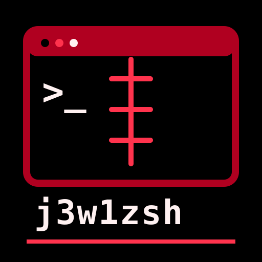

<p align="center">
  
</p>

<h1 align="center">j3w1zsh</h1>

<p align="center"><strong>one shell. every machine. zero compromise.</strong></p>

`j3w1zsh` is a public, shell-first workstation framework for native official Arch Linux,
official Arch Linux under WSL 2, and native Termux on Android. It combines a bounded CLI,
platform adapters, resumable phases, package presets and provenance, declarative themes,
strict project workspaces, safe migration, and remote tmux sessions without absorbing the
credentials or private state of the machine it configures.

The built-in theme keeps a true-black, blood-red, and warm-white visual language. Terminal ANSI
green intentionally maps to red; Neovim retains semantic green where meaning requires it.

## Supported platforms

| Target | Installer | Platform-specific behavior |
|---|---:|---|
| Native official Arch Linux | Yes | `pacman`, user configuration, and optional remote host |
| Official Arch Linux under WSL 2 | Yes | Arch behavior plus WSL/systemd and Windows Terminal adapters |
| Native main Termux on Android | Yes | `pkg`, Android storage/API/theme, and remote client |

WSL 1, Arch derivatives, generic Linux, macOS, Android root, and PRoot as an installation target
are rejected before mutation. PRoot remains an optional package in the full Termux preset.
Official Arch container/disposable-machine evidence is accepted for 1.0.0 when physical native
Arch hardware is unavailable; it is not described as real-hardware acceptance.

## Install

Inspect the checkout before running it:

```bash
git clone https://github.com/j3w1/j3w1zsh.git ~/j3w1zsh
cd ~/j3w1zsh
git status --short --branch
./install.sh --dry-run
./install.sh
```

The default `j3w1` preset preserves the full workstation capability. The smaller `minimal`
preset selects the shell, tmux, Neovim, SSH, required planning tools, and the built-in theme:

```bash
j3w1zsh install --preset minimal --dry-run
j3w1zsh install --preset minimal
```

Use `--no-packages`, `--do-not-install-anything`, or `-dnia` to reconcile configuration with
tools already present. Missing prerequisites are reported and never acquired in that mode.

Do not pipe mutable `main` into a shell. Versioned and migration bootstraps must be downloaded
from an immutable commit or tag, verified against the checksum tracked at that same revision,
inspected, and dry-run first. See [Installation Methods](https://github.com/j3w1/j3w1zsh/wiki/Installation-Methods).

## Commands

```text
j3w1zsh install|plan|update|status|doctor|platform
j3w1zsh backup|restore|reset-phase|migrate
j3w1zsh edit|attach|remote
j3w1zsh packages|theme|workspace|wiki
```

Run `j3w1zsh help`, `j3w1zsh help edit`, or `j3w1zsh help remote` for the exact contract.
Mutating families share one typed planner. `j3w1zsh plan` and every `--dry-run` path may inspect
the selected machine and repository but do not create state, trust, cache, Git refs, package
operations, or managed files.

Global `--json`, `--plain`, and `--color=auto|always|never` options may appear before or after
the command until `--`. Machine output is one stable JSON envelope with no banner or ANSI.

## Configuration and state

```text
~/.config/j3w1zsh/       trusted settings plus strict JSON overrides and themes
~/.local/state/j3w1zsh/  phase, backup, migration, package, workspace, and Wiki evidence
~/.cache/j3w1zsh/        disposable cache
```

`~/.config/j3w1zsh/settings.zsh` is trusted, user-owned shell configuration and is never
overwritten. Presets, package overrides, themes, workspaces, Wiki locks, and agent routes are
strict JSON and are never sourced. Conflicting managed files are backed up before replacement.

Credentials, private SSH keys, Codex or GitHub sessions, histories, private repositories,
documents, databases, and machine identity remain user-owned and are neither migrated nor
logged.

## Workspaces and migration

Project behavior is declared in a tracked `j3w1zsh.workspace.json` using strict schema v2 and
explicit `arch`, `wsl`, and/or `termux` targets. Candidate profiles can validate and plan but
cannot apply. Approved apply additionally requires tracked, committed-clean sources, exact
digest display, explicit trust, bounded managed-file adapters, and direct argv lifecycle.

The standalone `scripts/legacy/migrate-to-j3w1zsh.sh` handles complete or partial former
installations. It requires an immutable target ref plus its exact 40-character commit, journals
recovery, stops before cutover on authored or unique work, and keeps rollback rerunnable. Read
[Migrating from the Former Project](https://github.com/j3w1/j3w1zsh/wiki/Migrating-from-the-Former-Project)
before using it. Fresh acquisition preserves that exact target while establishing a full-history,
resolvable `origin/main`; the same bootstrap contains a guarded repair for the known shallow
`[gone]` state without rolling back or replacing a successful installation.

## Documentation and screenshots

The [version-pinned Wiki](https://github.com/j3w1/j3w1zsh/wiki) is the detailed human and agent
manual. `wiki-lock.json` names the exact compatible Wiki commit, while `agent-context.json`
routes maintainers to the minimum code and pages for a topic. Normal contributor changes
validate the pin and do not require Wiki write permission.

No relabelled legacy screenshots ship with 1.0.0. Genuine new captures remain pending human
pixel inspection for usernames, hostnames, paths, repositories, tokens, fingerprints, and
notifications. Follow the [Screenshot and Showcase Guide](https://github.com/j3w1/j3w1zsh/wiki/Screenshot-and-Showcase-Guide).

## Verification and contribution

```bash
tests/run.sh
git diff --check
git status --short
```

See [CONTRIBUTING.md](CONTRIBUTING.md), [SECURITY.md](SECURITY.md), and [AGENTS.md](AGENTS.md).
The project is independent and not affiliated with the projects that inspired its general
shell-framework and terminal-theme direction.

## License

[MIT](LICENSE)
